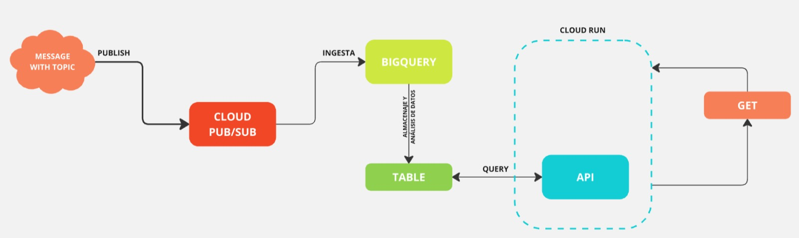

# 🚀 CHALLENGE DevSecOps/SRE ✈️

# Parte 1: Infraestructura e IaC

## Infraestructura 

### `PubSub`: 
Punto de Entrada de los datos bajo un tópico.

### `PubSub Subscription`
La suscripción creada dentro de PubSub captura los mensajes y los envía automáticamente a la tabla de BigQuery.

### `BigQuery`
Almacena los datos en formato de BYTES (según la configuración dada por este proyecto). Permite analizarlos bajo los campos definidos en el schema planteado.

### `BigQuery Table View`
La vista de BigQuery transforma/decodifica los datos en un formato que permite visualizar la información según los campos definidos en el schema.

### `Cloud Run`
La Cloud desplegada alberga la API creada la cual se enfoca en consultar y exponer a través de una query los datos almacenados en la Vista de la Tabla de BigQuery.

### 📉 Base de datos para el almacenamiento enfocado en analítica de datos 

BigQuery permite usar consultas de SQL para analizar tus datos. Este recurso permite almacenar y analizar los datos.

#### Esta configuración proporciona una ingesta de datos totalmente `nativa y automatizada`. No es necesario escribir código adicional para mover los datos desde Pub/Sub a BigQuery; Google Cloud maneja esto automáticamente.

### Este enfoque fue elegido por las siguientes razones:
- Es serverless y altamente escalable.
- No requiere mantenimiento de infraestructura.
- Puede manejar grandes volúmenes de datos de manera eficiente.

## IaC
Para esta primera parte del challenge, se creó la infraestructura necesaria a través de Terraform `(link de repositorio de Infra: https://github.com/alessadelisio/latam-devsecops-challenge-infrastructure.git)`. Se habilitaron las APIs, se creó el tópico y la subscripción de PubSub enlazada con Bigquery. Además, se creó la tabla y la view de la misma dentro de BigQuery.
Esta infraestructura fue deployeada en un pipeline de `GitHub`, donde se propusieron tres workflows. El primero, Terraform Plan, ejecuta entre varias cosas, `terraform plan` y genera un artefacto que posteriormente es consummido por el segundo workflow, `terraform apply`. El cual se encarga de levantar la infraestructura declarada. El último workflow, que es común en los dos repositorios propuestos, se denomina `Release`, el cual se encarga de generar el archivo `CHANGELOG` para los proyectos.

# Parte 2: Aplicaciones y flujo CI/CD

Para esta segunda parte, se actualizó el repositorio de Terraform. Creando un módulo IAM para así generar una cuenta de servicio con la finalidad de desplegar la `Cloud Run`. 
Y además, un artifact registry para poder almacenar y consumir la imagen de Docker para la `Cloud Run`. 
## Aplicación:
Según la recomendación del Challenge, se decidió levantar el endpoint con Cloud Run. Este recurso también se encuentra en el mismo entorno de GCP de los recursos seleccionados para la parte 1.
La aplicación creada en `python` 🐍, se encuentra alojada en `Cloud Run`. Esta API se enfoca en consultar y exponer los datos ya ingestados y transformados, utilizando la vista de `BigQuery` creada anteriormente.
## CI/CD
En este repositorio se declaran tres `workflows`. El primero estaría enfocado sólo en el desarrollo. Éste se ejecuta en las ramas de dev y feature y hace los jobs de revisar el formato y el linteo de los códigos dentro del repositorio. Además, ejecuta los tests incluidos en el proyecto. El segundo workflow se ejecuta únicamente en la rama master/main. Este workflow es el que deployea la imagen de Docker que usa la Cloud Run. Y el tercero, `RELEASE` explicado en el punto anterior del challenge.

# Parte 3: Pruebas de Integración y Puntos Críticos de Calidad 🌐
## Pruebas de Integración
Se generaron tests de integración para así asegurar la consistencia y la calidad de la API. Los jobs dedicados a estas pruebas buscan verificar la funcionalidad y la interoperabilidad entre los componentes. Los tests al realizarlos de manera automática en los pipelines correspondientes, ayudan a detectar errores tempranos y mantener la integridad del sistema.
El test de integración propuesto busca mockear la interacción entre la API desplegada en la Cloud Run con la base de datos de BigQuery, simulando un caso exitoso.

## Puntos Críticos de Calidad
1. Flexibilidad limitada en el procesamiento de datos:
La ingesta directa de Pub/Sub a BigQuery no permite un procesamiento complejo o transformaciones en tiempo real de los datos antes de su almacenamiento.
Si se requieren transformaciones más complejas, se tendría que realizar después en BigQuery, lo que podría aumentar los costos de procesamiento.

2. Costos potencialmente altos:
BigQuery cobra por almacenamiento y por consulta. Si se ingestan grandes volúmenes de datos sin filtrar, se podría incurrir en costos significativos.

### Para la medición de los puntos críticos se propone lo siguiente:

- Crear un dashboard en Google Cloud Monitoring con el fin de medir casos como: Bytes procesados por consulta, número de consultas ejecutadas, tiempo de ejecución de consultas, almacenamiento total utilizado, número de mensajes publicados y consumidos.

- Para esto también se deberá realizar pruebas de carga simulando diferentes volúmenes de datos y patrones de consulta; lo cual permitira medir el impacto en los costos.

### Para robustecer el sistema actual se propone la siquiente Arquitectura:

- Pub/Sub como punto de entrada de datos.
- Cloud Dataflow para procesamiento de datos en streaming.
- BigQuery como almacenamiento final.
- Cloud Function para la API.

#### Este enfoque tendría el siguien funcionamiento:
- Los datos llegan a Pub/Sub.
- Cloud Dataflow lee los mensajes de Pub/Sub en tiempo real.
- Dataflow procesa, transforma y enriquece los datos según sea necesario.
- Los datos procesados se escriben en BigQuery.

# Parte 4: Métricas y Monitoreo 📈

## 3 Métricas propuestas:
- Latencia de procesamiento end-to-end: tiempo desde que un mensaje es publicado en Pub/Sub hasta que está disponible para consulta en BigQuery. 
- Tasa de errores de ingesta: porcentaje de mensajes que fallan al ser ingestados en BigQuery desde Pub/Sub. Esta métrica permitiría identificar problemas en la calidad de los datos o en la configuración del pipeline.
- Costo por mensaje procesado: costo total (Pub/Sub + BigQuery) dividido por el número de mensajes procesados exitosamente. Esto para así poder proporcionar una visión clara de la eficiencia en costos del sistema.

### Herramienta de visualización:
Como se especifica en el punto 3, lo ideal sería utilizar Google Cloud Monitoring como herramienta de visualización de las métricas. 
En el dashboard principal se mostraría lo siguiente:
- Gráfico de líneas mostrando la latencia de procesamiento end-to-end a lo largo del tiempo.
- Gráfico de barras mostrando la tasa de errores de ingesta diaria.
- Gráfico de líneas mostrando el costo por mensaje procesado a lo largo del tiempo.
- Gráfico de áreas apiladas mostrando el volumen de mensajes procesados por hora.

Estas visualizaciones permitirían identificar tendencias en el rendimiento del sistema, detectar rápidamente aumentos en la tasa de errores o latencia, evaluar la eficiencia en costos del sistema a lo largo del tiempo y entender los patrones de uso para así poder planificar la capacidad adecuadamente y/o la migración a otro tipo de recursos.

### Implementación de Google Cloud Monitoring 🛎️
Para este punto se deberá activar Google `Cloud Monitoring` en el proyecto GCP mediante Terraform. Además, se deberán configurar los agentes de recopilación de métricas en los servicios de `Pub/Sub`, `BigQuery` y `Cloud Run`. 
Configurar el dashboard usando la interfaz web de Cloud Monitoring o mediante Terraform.
Establecer alertas basadas en umbrales para métricas críticas.

Recolección de métricas generales de los servicios de Pub/Sub y BigQuery, GCP recopila métricas automáticamente.
Para las métricas personalizadas (como latencia end-to-end), se puede implementar un Cloud Function que calcule y reporte estas métricas periódicamente.

### Escalamiento 📏
Si se escala a 50 sistemas similares se deberá actualizar la visualización de la siguiente manera:
- Se debería añadir un panel de resumen que muestre métricas agregadas de todos los sistemas.
- Crear una tabla general que muestre el estado de salud de cada unos de los sistemas.
- Crear vistas detalladas para cada sistema individualmente.

📊 Nuevas métricas:
- Comparación de rendimiento entre sistemas (gráfico de barras).
- Correlación entre métricas de diferentes sistemas (gráfico de dispersión).
- Análisis de tendencias entre sistemas (gráficos de líneas múltiples).

### Dificultades y/o limitaciones podrían surgir a nivel de observabilidad de
los sistemas de no abordarse correctamente el problema de escalabilidad

- Complejidad de correlación: el identificar problemas que afecten a múltiples sistemas puede volverse complicado. La solució sería implementar análisis de causa y buscar la correlación de eventos.
- Latencia en la recopilación de métricas: la recopilación de datos de múltiples sistemas puede incurrir en retrasos.Se deberá optimizar la frecuencia de recopilación y usar técnicas de streaming para métricas críticas. Para esto es recomendable la implementación de la arquitectura anteriormente mencionada con el recurso de Dataflow.
- Costo de almacenamiento y procesamiento: el almacenamiento y procesar las métricas de 50 sistemas puede ser costoso. Por lo que la solución iría de la mano con el punto anterior de una nueva arquitectura. 
- Mantenimiento de dashboards: mantener dashboards relevantes para 50 sistemas puede ser laborioso. La solución deberá ser usar templates de dashboard y automatizar la creación y actualización de ellos.
- Sobrecarga de alertas: el aumento de sistemas puede llevar a una sobrecarga de alertas. Para no incurrir en una sobrecarga, se puede generar agrupaciones de alertas para así reducir el ruido.
